# revolut-like-project
# 💳 Fintech Thesis Project – API-based Wallet Demo (Revolut-inspired)

> **Course:** Informatica per le Aziende Digitali (L-31)  
> **A.A.:** 2024–2025  
> **Student:** [Nome Cognome]  
> **Project Work:** Applicazione Full-Stack API-based per un’impresa del settore finanziario  
> **Supervisore:** [Nome Docente]

---

## 🧭 Overview

Questo project work realizza un’applicazione **full-stack API-based** ispirata al modello **Revolut**, progettata per la **gestione di conti e transazioni multivaluta** con dashboard analitica, autenticazione sicura e architettura scalabile.

Il prototipo rappresenta un **wallet simulato**, non collegato a circuiti finanziari reali, ma conforme ai principi di **security by design** e **privacy by design** previsti dalle **Linee Guida AgID**, dal **GDPR** e dalla **PSD2**.

---

## 🧱 Architettura generale

```mermaid
flowchart LR
  classDef sec fill:#e8f5e9,stroke:#2e7d32,color:#1b5e20
  classDef comp fill:#eef3ff,stroke:#3f51b5,color:#1a237e
  classDef data fill:#fff8e1,stroke:#f9a825,color:#6d4c41
  classDef obs fill:#f3e5f5,stroke:#7b1fa2,color:#4a148c

  U[Utente] --> FE[Frontend React/TS]:::comp
  FE -->|OIDC Auth Code + PKCE| KC[Keycloak IdP]:::sec
  FE -->|REST/JSON| GW[API Gateway NGINX]:::sec
  GW -->|Validate JWT · CORS · Rate limit| BE[Backend FastAPI]:::comp
  BE --> DB[(PostgreSQL\nRLS + pgcrypto)]:::data
  BE --- VAULT[[Vault/KMS\nSecrets & Keys]]:::data
  BE --> CACHE[(Redis)]:::data
  BE --> OTEL[[OpenTelemetry]]:::obs
  OTEL --> LOGS[(Loki/ELK)]:::obs
  OTEL --> METRICS[(Prometheus)]:::obs
  METRICS --> GRAF[(Grafana)]:::obs
```



### 🔹 Stack tecnologico
| Componente | Tecnologia | Ruolo |
|-------------|-------------|-------|
| **Frontend** | React + TypeScript + Vite | UI web SPA con login OIDC e dashboard |
| **Backend** | FastAPI + Pydantic | API REST, logica business e validazione dati |
| **Database** | PostgreSQL + pgcrypto + RLS | Dati persistenti, cifratura e sicurezza per riga |
| **Identity Provider** | Keycloak (OIDC/OAuth2) | Gestione utenti, MFA e ruoli |
| **API Gateway** | NGINX | Reverse proxy, rate limiting e headers di sicurezza |
| **Observability** | Prometheus + Grafana + Loki | Metriche, dashboard e logging strutturato |
| **DevOps** | Docker Compose + GitHub Actions | Deploy e CI/CD integrati |

---

## ⚙️ Funzionalità principali

- 🔐 **Login sicuro OIDC** (PKCE, JWT access token)  
- 💼 **Gestione conti e movimenti** con filtri e paginazione  
- ♻️ **Creazione transazioni simulate** con *Idempotency-Key*  
- 📊 **Dashboard** con analisi base (categorie, spese, saldo)  
- 🧱 **Hardening**: CSP, HSTS, CORS, rate-limit, audit trail  
- 🧠 **Accessibilità base** (focus, aria-label, contrasto)

---

## 🧩 Modello dati (sintesi)

| Entità | Descrizione |
|---------|--------------|
| **User** | id, email_enc (pgcrypto), created_at |
| **Account** | id, user_id, currency, balance, name |
| **Transaction** | id, user_id, account_id, amount, currency, category, idem_key, created_at |

**Vincoli:**  
- Row-Level Security su `user_id`  
- `idem_key` univoco per idempotenza  
- Colonne PII cifrate tramite `pgcrypto`

---

## 🔒 Sicurezza & conformità

Il progetto integra principi delle **Linee Guida AgID per lo sviluppo del software sicuro**, del **GDPR** e della **PSD2**:

| Area | Misure applicate |
|------|------------------|
| **Autenticazione** | OIDC con Keycloak, MFA, token a breve vita |
| **Autorizzazione** | Scopes e ruoli per endpoint (es. `transactions:read`) |
| **Cifratura** | TLS, pgcrypto, Vault/KMS per segreti |
| **Accessibilità** | WCAG base, AgID UI guidelines |
| **Privacy** | Minimizzazione, log pseudonimizzati, retention policy |
| **Hardening** | Security headers, CORS ristretto, rate limit |
| **Audit** | Logging JSON, correlation ID, audit trail transazioni |

---

## 🧰 Installazione e avvio rapido

### Prerequisiti
- Docker & Docker Compose  
- Node.js (≥ 18) se vuoi sviluppare la UI  
- Python (≥ 3.11) per sviluppo backend

### Avvio rapido
```bash
git clone https://github.com/tuo-username/thesis-fintech-wallet.git
cd thesis-fintech-wallet
cp .env.example .env
docker compose up -d --build
```

### Servizi attivi
| Servizio | Porta | Descrizione |
|-----------|-------|-------------|
| Frontend | 5173 | React/Vite |
| Backend API | 8000 | FastAPI REST |
| Keycloak | 8081 | Identity Provider |
| Gateway | 8080 | Reverse proxy + CORS |
| PostgreSQL | 5432 | Database |
| Grafana | 3000 | Dashboard metriche |

---

## 🧪 Test & validazione

- **Unit / Integration:** `pytest`, fixture su DB temporaneo  
- **API / Contract:** Postman + Newman CLI  
- **Security:** OWASP ZAP baseline, lint (ruff + eslint), SAST/DAST (Semgrep, Bandit, Trivy)  
- **CI/CD:** GitHub Actions → build, test, build immagini, pubblicazione  
- **Demo script:** `make demo` crea utenti e transazioni simulate

---

## 🧩 Roadmap (prime 2 settimane)

| Giorni | Attività principali |
|--------|----------------------|
| 1–2 | Setup repo, OpenAPI bozza, ER model |
| 3–4 | DB Postgres con RLS e cifratura |
| 5–6 | Keycloak + OAuth2 scopes |
| 7 | FastAPI endpoints `/accounts`, `/transactions` |
| 8–9 | React SPA con login e dashboard |
| 10 | Hardening (CSP, CORS, rate-limit) |
| 11 | CI/CD pipeline e test automatici |
| 12–14 | Docker Compose finale, demo e documentazione |

---

## 📜 Licenza
Questo progetto utilizza licenze **open source** (MIT / Apache 2.0) coerenti con le **Linee Guida AgID per il riuso del software**.

---

## 📚 Riferimenti
- [AgID – Linee guida per lo sviluppo del software sicuro](https://www.agid.gov.it/it/linee-guida)
- [GDPR UE 2016/679](https://eur-lex.europa.eu/eli/reg/2016/679/oj)
- [PSD2 – Direttiva (UE) 2015/2366](https://eur-lex.europa.eu/eli/dir/2015/2366/oj)
- [OWASP API Security Top 10](https://owasp.org/www-project-api-security/)
- [FastAPI Docs](https://fastapi.tiangolo.com/)
- [Keycloak Documentation](https://www.keycloak.org/documentation)
- [Docker Compose](https://docs.docker.com/compose/)

---

## 🧠 Considerazioni conclusive

Il progetto dimostra come sia possibile **coniugare architettura moderna, sicurezza normativa e praticità ingegneristica**.  
In un contesto accademico, rappresenta un esempio di **digitalizzazione consapevole**: tecnicamente solido, aderente alle linee guida nazionali e pronto per evolvere verso scenari professionali reali nel settore fintech.
