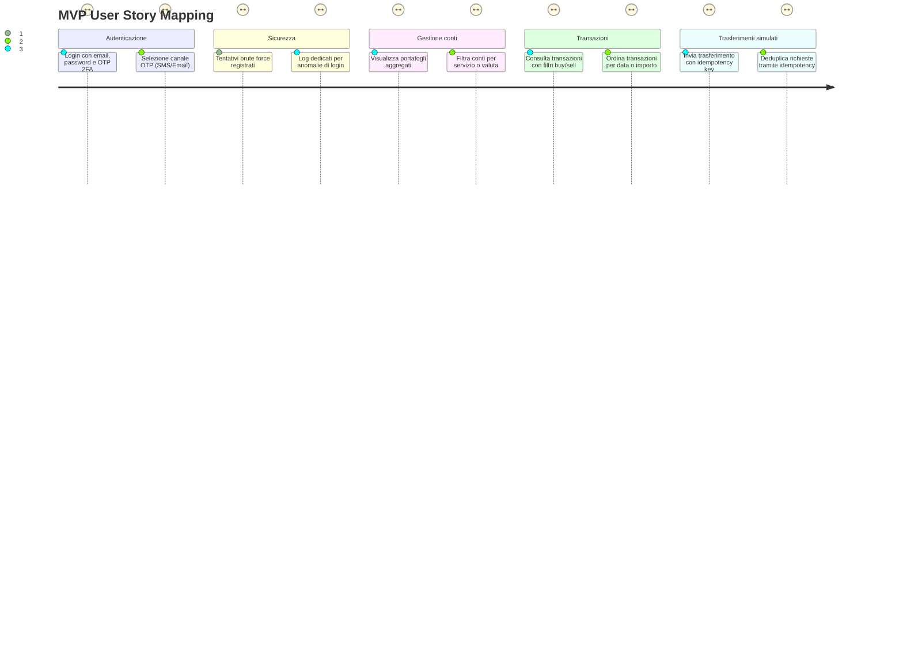

# User Story

**Data**: 2025-10-20 · **Giorno di sviluppo**: Day 1

## Vista sintetica (Mermaid)

## Dettaglio User Stories

- **Cliente retail**: In quanto cliente retail voglio autenticarmi con email, password e un OTP di 1 minuto consegnato sul mio canale preferito (SMS o email) così da accedere in sicurezza ai miei conti.
- **Cliente retail**: In quanto cliente retail voglio scegliere se ricevere l'OTP via SMS o email così da completare il login anche quando un canale non è disponibile.
- **Cliente retail**: In quanto cliente retail voglio vedere tutti i miei portafogli e conti aggregati per provider così da avere una vista unificata di saldi e servizi (Revolut, Hype, ecc.).
- **Cliente retail**: In quanto cliente retail voglio filtrare l'elenco conti per provider o valuta così da concentrarmi sul portafoglio rilevante per l'attività corrente.
- **Cliente retail**: In quanto cliente retail voglio consultare le transazioni con filtri per servizio e tipo (buy/sell) così da analizzare rapidamente la mia attività.
- **Cliente retail**: In quanto cliente retail voglio ordinare e filtrare le transazioni per data e importo così da individuare a colpo d'occhio operazioni recenti o anomale.
- **Cliente retail**: In quanto cliente retail voglio inviare un trasferimento simulato fornendo una idempotency key così da evitare duplicati in caso di invio ripetuto.
- **Servizio trasferimenti**: In quanto servizio trasferimenti voglio persistere le idempotency key insieme ai metadati del trasferimento così da deduplicare le richieste identiche e supportare gli audit.
- **Threat user**: In quanto threat user voglio tentare ripetutamente il login così che il sistema possa validare le sue contromisure contro il brute force.
- **Sistema sicurezza**: In quanto sistema di sicurezza voglio registrare e segnalare gli eccessivi tentativi di login falliti così da attivare alert e politiche di rate limiting.
