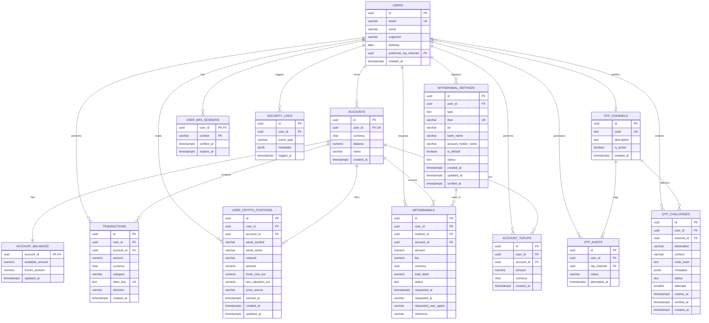

# Modello ER - Fintech Wallet Database

## Diagramma Entità-Relazioni



---

## Descrizione Entità

### 👤 USERS
Tabella principale degli utenti registrati nel sistema.

**Attributi**:
- `id` (UUID, PK): Identificativo univoco utente
- `email` (VARCHAR, UNIQUE): Email utente (cifrabile con pgcrypto)
- `nome` (VARCHAR): Nome utente
- `cognome` (VARCHAR): Cognome utente
- `birthday` (DATE): Data di nascita
- `preferred_otp_channel` (UUID, FK): Canale OTP preferito
- `created_at` (TIMESTAMPTZ): Data creazione account

**Vincoli**:
- Email univoca
- Row-Level Security (RLS) attivo su `user_id`

---

### 💼 ACCOUNTS
Conti multi-valuta degli utenti. Relazione 1:1 con Users (un utente = un conto).

**Attributi**:
- `id` (UUID, PK): Identificativo univoco conto
- `user_id` (UUID, FK, UNIQUE): Riferimento utente proprietario
- `currency` (CHAR(3)): Codice valuta ISO 4217 (EUR, USD, GBP)
- `balance` (NUMERIC(18,2)): Saldo totale conto
- `name` (VARCHAR): Nome mnemonico conto
- `created_at` (TIMESTAMPTZ): Data creazione

**Vincoli**:
- Un utente può avere un solo account (UNIQUE su `user_id`)
- Trigger `create_default_account_for_user` crea automaticamente account per nuovi utenti
- RLS attivo

---

### 💰 ACCOUNT_BALANCES
Gestione saldi disponibili e bloccati per frozen funds.

**Attributi**:
- `account_id` (UUID, PK, FK): Riferimento account
- `available_amount` (NUMERIC(18,2)): Saldo disponibile per operazioni
- `frozen_amount` (NUMERIC(18,2)): Saldo bloccato (prelievi pending)
- `updated_at` (TIMESTAMPTZ): Ultimo aggiornamento

**Vincoli**:
- `balance = available_amount + frozen_amount`
- Trigger di sincronizzazione con `accounts.balance`

---

### 💳 ACCOUNT_TOPUPS
Cronologia ricariche simulate del conto.

**Attributi**:
- `id` (UUID, PK): Identificativo ricarica
- `user_id` (UUID, FK): Utente che ha effettuato la ricarica
- `account_id` (UUID, FK): Conto ricaricato
- `amount` (NUMERIC(18,2)): Importo ricaricato
- `currency` (CHAR(3)): Valuta ricarica
- `created_at` (TIMESTAMPTZ): Data ricarica

**Vincoli**:
- RLS attivo

---

### 📊 TRANSACTIONS
Transazioni finanziarie con sistema di idempotenza.

**Attributi**:
- `id` (UUID, PK): Identificativo transazione
- `user_id` (UUID, FK): Utente proprietario
- `account_id` (UUID, FK): Conto coinvolto
- `amount` (NUMERIC(18,2)): Importo transazione
- `currency` (CHAR(3)): Valuta transazione
- `category` (VARCHAR): Categoria opzionale (food, transport, ecc.)
- `idem_key` (TEXT, UNIQUE): Chiave idempotenza
- `direction` (VARCHAR): Direzione (buy/sell)
- `created_at` (TIMESTAMPTZ): Data creazione

**Vincoli**:
- `idem_key` univoca per prevenire duplicazioni
- `direction` IN ('buy', 'sell')
- RLS attivo

---

### 🪙 USER_CRYPTO_POSITIONS
Posizioni crypto aggregate per ticker.

**Attributi**:
- `id` (UUID, PK): Identificativo posizione
- `user_id` (UUID, FK): Utente proprietario
- `account_id` (UUID, FK): Conto collegato
- `asset_symbol` (VARCHAR): Ticker asset (BTC, ETH, ecc.)
- `asset_name` (VARCHAR): Nome descrittivo
- `network` (VARCHAR): Blockchain (Bitcoin, Ethereum, ecc.)
- `amount` (NUMERIC(28,10)): Quantità detenuta
- `book_cost_eur` (NUMERIC(18,2)): Costo di carico in EUR
- `last_valuation_eur` (NUMERIC(18,2)): Valutazione corrente in EUR
- `price_source` (VARCHAR): Provider quotazione (CoinCap)
- `synced_at` (TIMESTAMPTZ): Ultimo sync quotazioni
- `created_at` (TIMESTAMPTZ): Data creazione posizione
- `updated_at` (TIMESTAMPTZ): Ultimo aggiornamento

**Vincoli**:
- UNIQUE su (`user_id`, `asset_symbol`)
- Trigger `set_updated_at` aggiorna automaticamente `updated_at`
- RLS attivo

---

### 🏦 WITHDRAWAL_METHODS
Metodi di prelievo bancari registrati (IBAN).

**Attributi**:
- `id` (UUID, PK): Identificativo metodo
- `user_id` (UUID, FK): Utente proprietario
- `type` (TEXT): Tipo metodo (BANK_ACCOUNT)
- `iban` (VARCHAR, UNIQUE): Codice IBAN
- `bic` (VARCHAR): Codice BIC/SWIFT
- `bank_name` (VARCHAR): Nome banca
- `account_holder_name` (VARCHAR): Intestatario conto
- `is_default` (BOOLEAN): Metodo predefinito
- `status` (TEXT): Stato verifica (PENDING_VERIFICATION, VERIFIED, REJECTED)
- `created_at` (TIMESTAMPTZ): Data registrazione
- `updated_at` (TIMESTAMPTZ): Ultimo aggiornamento
- `verified_at` (TIMESTAMPTZ): Data verifica

**Vincoli**:
- IBAN univoco
- UNIQUE INDEX su (`user_id`) WHERE `is_default = true` (un solo default per utente)
- `type` IN ('BANK_ACCOUNT')
- `status` IN ('PENDING_VERIFICATION', 'VERIFIED', 'REJECTED')

---

### 💸 WITHDRAWALS
Richieste di prelievo con frozen funds.

**Attributi**:
- `id` (UUID, PK): Identificativo prelievo
- `user_id` (UUID, FK): Utente richiedente
- `method_id` (UUID, FK): Metodo di prelievo utilizzato
- `account_id` (UUID, FK): Conto sorgente
- `amount` (NUMERIC(18,2)): Importo richiesto
- `fee` (NUMERIC(18,2)): Fee applicata (1% min €2)
- `currency` (CHAR(3)): Valuta prelievo
- `total_debit` (NUMERIC(18,2)): Totale addebitato (amount + fee)
- `status` (TEXT): Stato prelievo
- `requested_at` (TIMESTAMPTZ): Data richiesta
- `requested_ip` (VARCHAR): IP richiedente
- `requested_user_agent` (VARCHAR): User agent richiedente
- `reference` (VARCHAR): Riferimento univoco (WD-XXXXXXXXXX)

**Vincoli**:
- `status` IN ('PENDING', 'PROCESSING', 'COMPLETED', 'FAILED', 'UNDER_REVIEW')
- Indice su `user_id` e `status`
- Fondi bloccati in `account_balances.frozen_amount` durante PENDING

---

### 📱 OTP_CHANNELS
Canali disponibili per invio OTP (EMAIL, SMS).

**Attributi**:
- `id` (UUID, PK): Identificativo canale
- `code` (TEXT, UNIQUE): Codice canale (EMAIL, SMS)
- `description` (TEXT): Descrizione canale
- `is_active` (BOOLEAN): Canale attivo
- `created_at` (TIMESTAMPTZ): Data creazione

**Vincoli**:
- `code` univoco

---

### 🔐 OTP_CHALLENGES
Challenge OTP attive con gestione tentativi.

**Attributi**:
- `id` (UUID, PK): Identificativo challenge
- `user_id` (UUID, FK): Utente destinatario
- `channel_id` (UUID, FK): Canale utilizzato
- `destination` (VARCHAR): Destinazione (email/numero)
- `context` (VARCHAR): Contesto verifica (default, payout, ecc.)
- `code_hash` (TEXT): Hash del codice OTP
- `metadata` (JSONB): Metadati aggiuntivi
- `status` (TEXT): Stato challenge (PENDING, VERIFIED, EXPIRED, BLOCKED)
- `attempts` (SMALLINT): Numero tentativi effettuati
- `expires_at` (TIMESTAMPTZ): Scadenza challenge
- `verified_at` (TIMESTAMPTZ): Data verifica
- `created_at` (TIMESTAMPTZ): Data creazione

**Vincoli**:
- Indice su (`user_id`, `context`, `status`)
- Indice su `expires_at` per cleanup automatico
- Max 5 tentativi prima di BLOCKED

---

### 📝 OTP_AUDITS
Audit log tentativi OTP.

**Attributi**:
- `id` (UUID, PK): Identificativo audit
- `user_id` (UUID, FK): Utente coinvolto
- `otp_channel` (UUID, FK): Canale utilizzato
- `status` (VARCHAR): Esito (success, failed, blocked)
- `attempted_at` (TIMESTAMPTZ): Data tentativo

**Vincoli**:
- `status` IN ('success', 'failed', 'blocked')
- RLS attivo

---

### ✅ USER_MFA_SESSIONS
Sessioni MFA verificate (TTL 5 minuti).

**Attributi**:
- `user_id` (UUID, PK, FK): Utente verificato
- `context` (VARCHAR, PK): Contesto verifica
- `verified_at` (TIMESTAMPTZ): Data verifica
- `expires_at` (TIMESTAMPTZ): Scadenza sessione

**Vincoli**:
- Chiave primaria composita (`user_id`, `context`)
- Indice su `expires_at` per cleanup

---

### 🛡️ SECURITY_LOGS
Log eventi di sicurezza.

**Attributi**:
- `id` (UUID, PK): Identificativo log
- `user_id` (UUID, FK): Utente coinvolto (nullable)
- `event_type` (VARCHAR): Tipo evento (login_failed, brute_force_detected, ecc.)
- `metadata` (JSONB): Dettagli evento
- `logged_at` (TIMESTAMPTZ): Data evento

**Vincoli**:
- RLS attivo

---

## Indici e Performance

### Indici Principali

```sql
-- Users
CREATE UNIQUE INDEX uq_users_email ON users (email);

-- Accounts
CREATE UNIQUE INDEX uq_accounts_user_id ON accounts (user_id);

-- Transactions
CREATE UNIQUE INDEX uq_transactions_idem_key ON transactions (idem_key);
CREATE INDEX idx_transactions_user_created ON transactions (user_id, created_at DESC);

-- Crypto Positions
CREATE UNIQUE INDEX uq_user_crypto_positions_user_asset ON user_crypto_positions (user_id, asset_symbol);

-- Withdrawal Methods
CREATE UNIQUE INDEX withdrawal_methods_iban_unique ON withdrawal_methods (iban);
CREATE UNIQUE INDEX withdrawal_methods_default_idx ON withdrawal_methods (user_id) WHERE is_default;

-- Withdrawals
CREATE INDEX withdrawals_user_idx ON withdrawals (user_id);
CREATE INDEX withdrawals_status_idx ON withdrawals (status);

-- OTP Challenges
CREATE INDEX otp_challenges_user_idx ON otp_challenges (user_id, context, status);
CREATE INDEX otp_challenges_expires_idx ON otp_challenges (expires_at);

-- MFA Sessions
CREATE INDEX user_mfa_sessions_expires_idx ON user_mfa_sessions (expires_at);
```

---

## Row-Level Security (RLS)

Tutte le tabelle principali implementano RLS basato su `user_id`:

```sql
-- Esempio policy RLS per accounts
ALTER TABLE accounts ENABLE ROW LEVEL SECURITY;

CREATE POLICY accounts_isolation_policy ON accounts
    USING (user_id::text = current_setting('app.current_user_id', true));
```

**Tabelle con RLS attivo**:
- `users`
- `accounts`
- `account_balances`
- `account_topups`
- `transactions`
- `user_crypto_positions`
- `withdrawal_methods`
- `withdrawals`
- `otp_challenges`
- `otp_audits`
- `user_mfa_sessions`
- `security_logs`

---

## Trigger e Automazioni

### 1. Creazione Account Automatica
```sql
CREATE TRIGGER trg_create_default_account
    AFTER INSERT ON users
    FOR EACH ROW
    EXECUTE FUNCTION create_default_account_for_user();
```

### 2. Sincronizzazione Saldi
```sql
CREATE TRIGGER sync_account_balance_on_update
    AFTER UPDATE ON account_balances
    FOR EACH ROW
    EXECUTE FUNCTION sync_account_balance();
```

### 3. Aggiornamento Timestamp
```sql
CREATE TRIGGER trg_user_crypto_positions_updated_at
    BEFORE UPDATE ON user_crypto_positions
    FOR EACH ROW
    EXECUTE FUNCTION set_updated_at();
```

### 4. Vincolo Account Unico
```sql
CREATE TRIGGER trg_accounts_single_per_user
    BEFORE INSERT ON accounts
    FOR EACH ROW
    EXECUTE FUNCTION enforce_single_account_per_user();
```

---

## Relazioni Principali

### Relazioni 1:1
- `USERS` ↔ `ACCOUNTS`: Un utente ha esattamente un account
- `ACCOUNTS` ↔ `ACCOUNT_BALANCES`: Un account ha esattamente un record balance

### Relazioni 1:N
- `USERS` → `TRANSACTIONS`: Un utente può avere molte transazioni
- `USERS` → `USER_CRYPTO_POSITIONS`: Un utente può avere molte posizioni crypto
- `USERS` → `WITHDRAWAL_METHODS`: Un utente può registrare molti IBAN
- `USERS` → `WITHDRAWALS`: Un utente può richiedere molti prelievi
- `ACCOUNTS` → `TRANSACTIONS`: Un account contiene molte transazioni
- `WITHDRAWAL_METHODS` → `WITHDRAWALS`: Un metodo può essere usato per molti prelievi
- `OTP_CHANNELS` → `OTP_CHALLENGES`: Un canale può gestire molte challenge

### Relazioni N:M
- `USERS` ↔ `OTP_CHANNELS`: Relazione opzionale tramite `preferred_otp_channel`

---

## Considerazioni di Design

### Sicurezza
- **RLS**: Isolamento dati garantito a livello database
- **Hashing**: Codici OTP mai salvati in chiaro
- **Audit Trail**: Ogni operazione critica tracciata
- **Frozen Funds**: Prevenzione double-spending durante prelievi

### Performance
- **Indici strategici**: Su colonne frequentemente filtrate
- **Partitioning**: Considerare per `transactions` e `security_logs` in produzione
- **Connection Pooling**: Gestito da psycopg con limiti configurabili

### Scalabilità
- **UUID**: Permettono sharding futuro
- **JSONB**: Flessibilità per metadati senza schema rigido
- **Timestamptz**: Timezone-aware per deployment multi-region

### Integrità
- **Foreign Keys**: Garantiscono consistenza referenziale
- **Check Constraints**: Validazione valori (es. direction, status)
- **Unique Constraints**: Prevenzione duplicati (email, IBAN, idem_key)
- **Trigger**: Automazioni per consistenza dati
