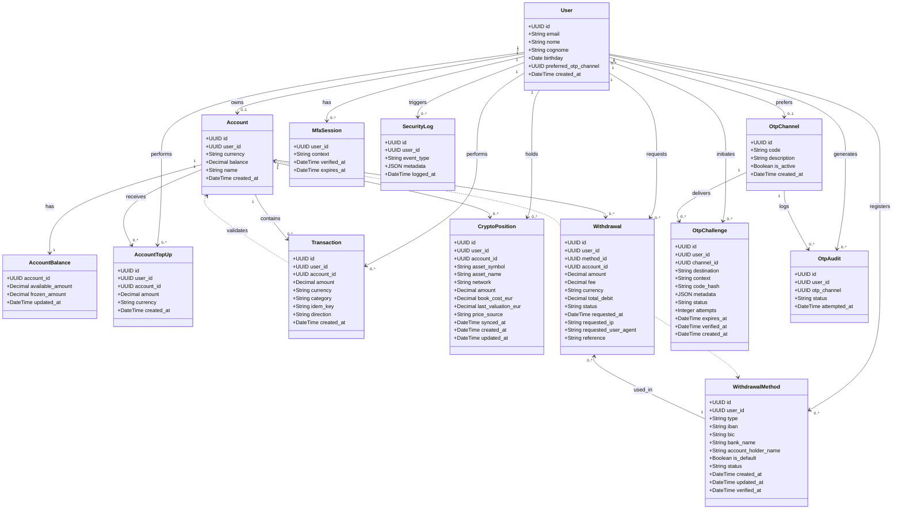
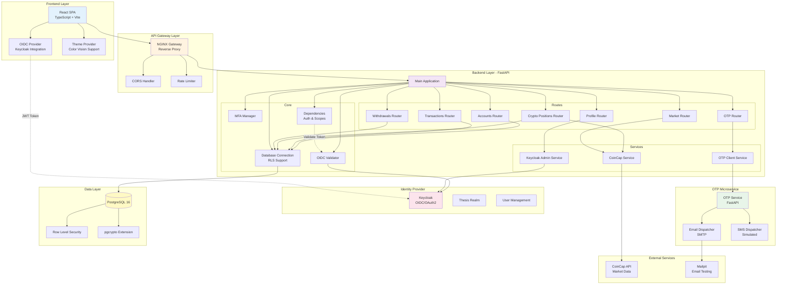
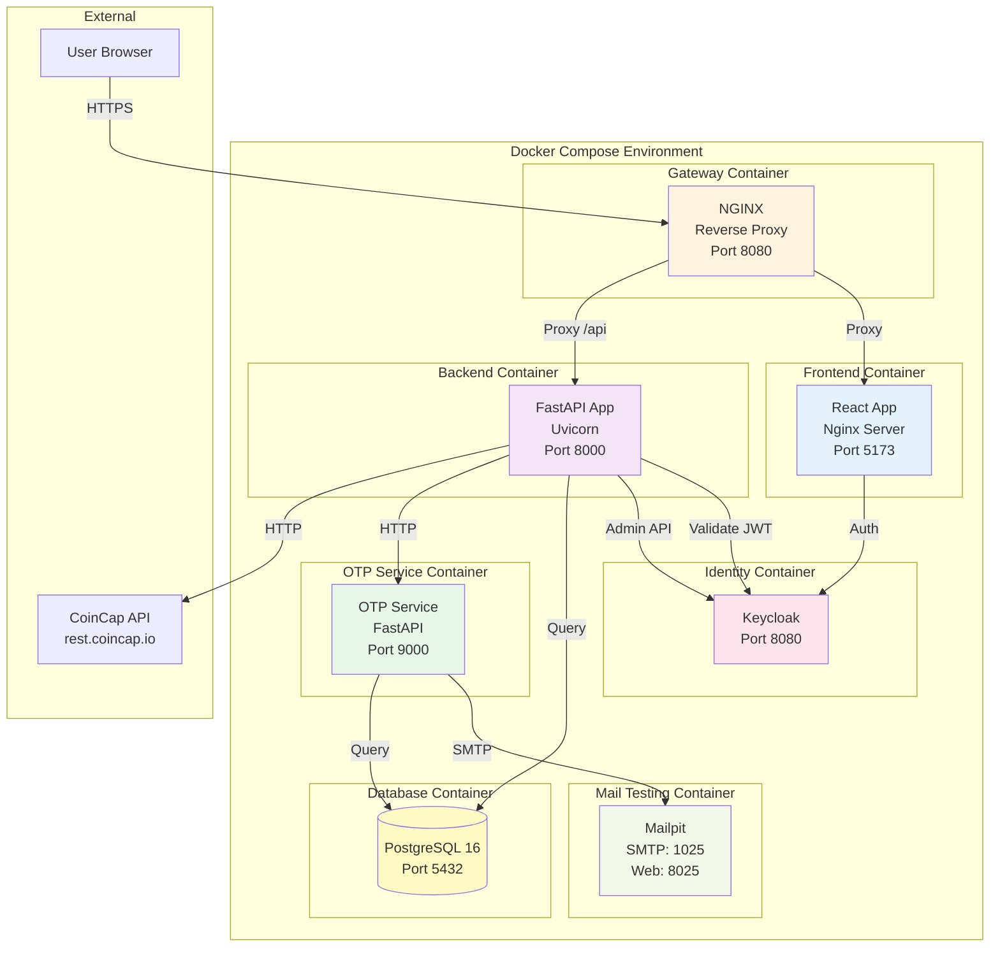
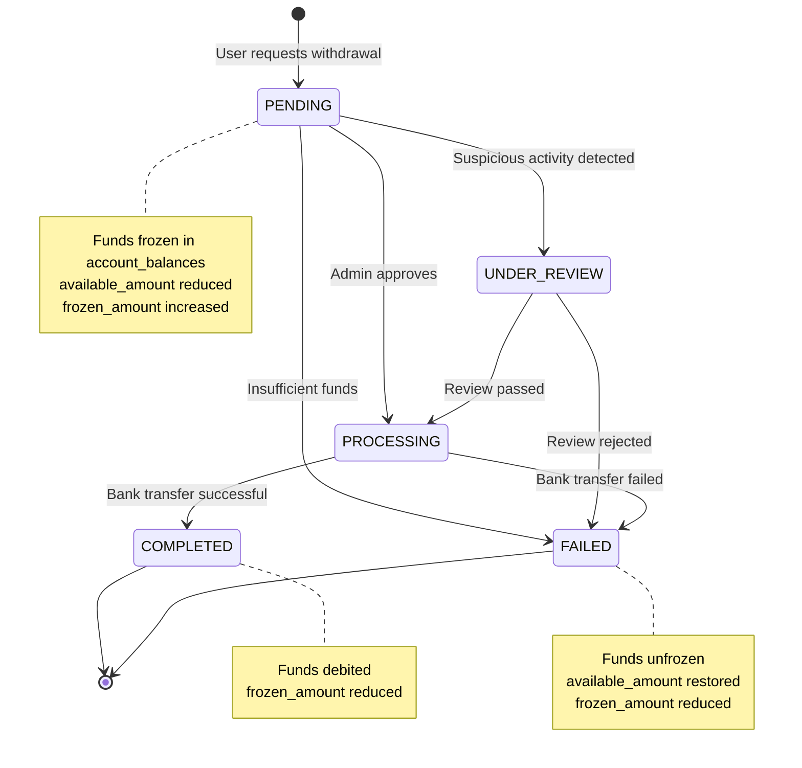
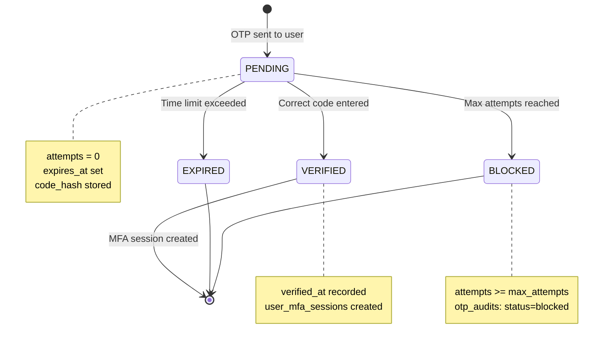

# Diagramma UML - Fintech Wallet Application

## Diagramma delle Classi (Class Diagram)

## Diagramma dei Componenti (Component Diagram)

## Diagramma di Deployment

## Diagramma degli Stati - Withdrawal Process

## Diagramma degli Stati - OTP Challenge

## Note Architetturali

### Sicurezza
- **Row-Level Security (RLS)**: Tutte le tabelle principali implementano RLS basato su `user_id`
- **OIDC/OAuth2**: Autenticazione tramite Keycloak con PKCE flow
- **Scope-based Authorization**: Endpoint protetti da scope specifici (es. `transactions:write`)
- **Idempotency**: Chiave `idem_key` univoca per prevenire transazioni duplicate
- **MFA**: Sistema OTP con challenge/response e sessioni temporanee
- **Audit Trail**: Logging completo di operazioni OTP e eventi di sicurezza

### Pattern Implementati
- **Repository Pattern**: Accesso al database tramite connessioni con RLS
- **Dependency Injection**: FastAPI dependencies per auth, scopes e connessioni DB
- **Microservices**: OTP service separato dal backend principale
- **API Gateway**: NGINX per routing, CORS e rate limiting
- **Event Sourcing**: Audit logs e security logs per tracciabilità

### Tecnologie Chiave
- **Backend**: FastAPI (Python), Pydantic, psycopg (async)
- **Frontend**: React, TypeScript, Vite, oidc-client-ts
- **Database**: PostgreSQL 16 con pgcrypto
- **Identity**: Keycloak (OIDC provider)
- **Infrastructure**: Docker Compose, NGINX
